## Praktikum 4: PHP Modular

Nama: Laela Nur Rohmah

Nim: 312110425

Kelas: TI.21.A.3

## 1. Membuat file baru dengan nama header.php

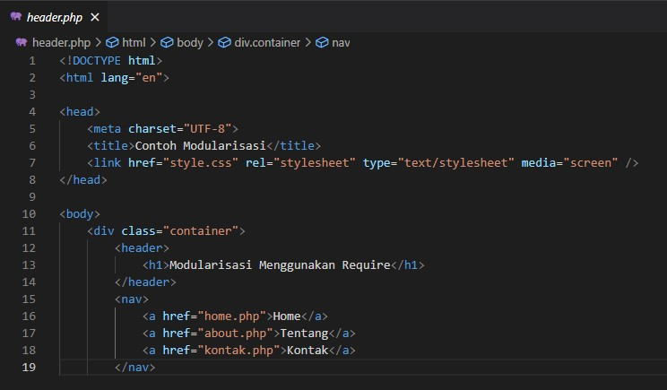

## 2. Membuat file baru dengan nama footer.php

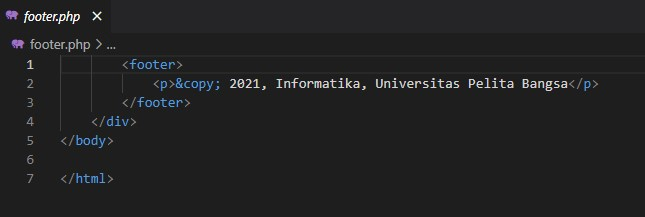

## 3. Membuat file baru dengan nama home.php

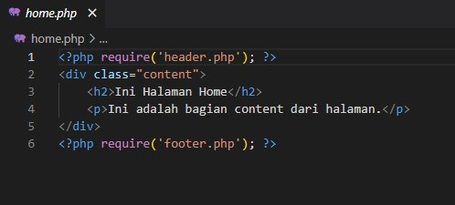

## 4. Membuat file baru dengan nama about.php

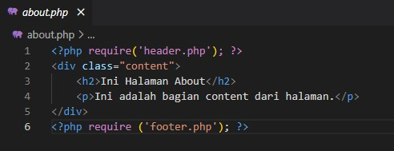

## MEMBUAT ROUTING

menyiapkan file utama (index.php) yang berisi routing untuk mengakses banyak 
halaman. 

cara aksesnya :

• Halaman Home ( http://localhost/lab4_php_modular/index.php?mod=home )

• Halaman About ( http://localhost/lab4_php_modular/index.php?mod=about )

## 5. Membuat file baru dengan nama index.php

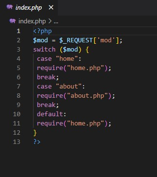

Dengan hasil Output seperti:

•home:

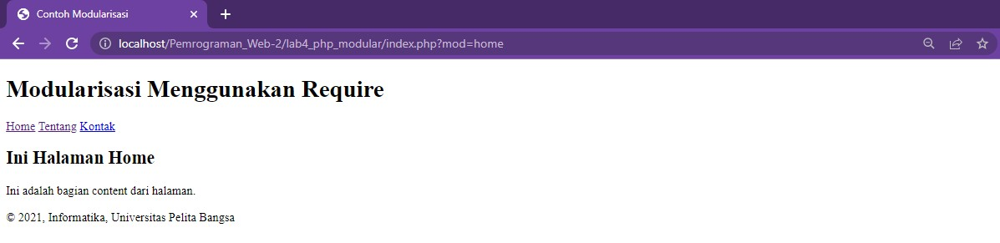

•about:

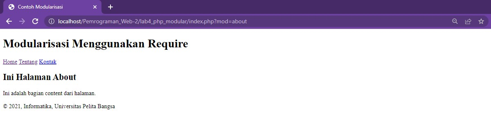

## Aktivasi mod_rewrite (.htaccess)

Langkah awal yang harus disiapkan adalah aktivasi mod_rewrite pada webserver Apache2 pada configurasi httpd.conf.
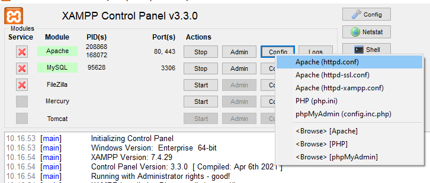

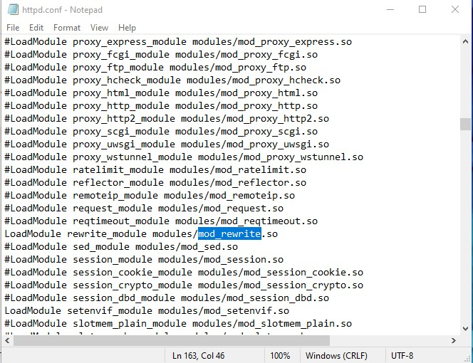

Aktifkan LoadModule mod_rewrite dengan cara melakukan un-comment pada baris tersebut.

## 7. Membuat file baru dengan nama .htaccess

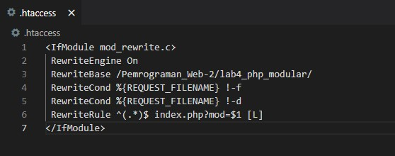

Cara aksesnya menjadi:

• Halaman Home ( http://localhost/lab4_php_modular/home )

• Halaman About ( http://localhost/lab4_php_modular/about )

Dan Hasil Outputnya yaitu:

•home:

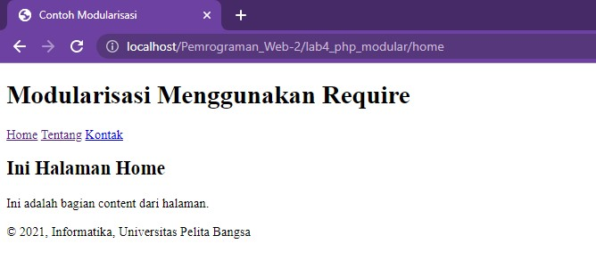

•about:

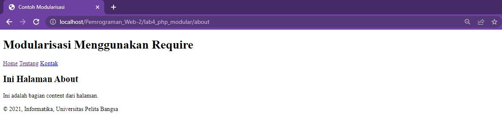

## TUGAS 4

Mengimplementasikan konsep modularisasi pada kode program praktikum 3 tentang database, sehingga setiap halamannya memiliki template tampilan yang sama

## 1. tampilan .htaccsess

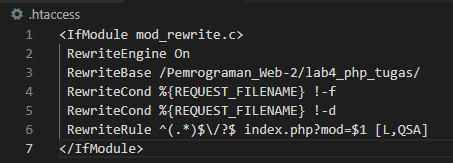

## Tampilan output

## 2. Tampilan home.php:

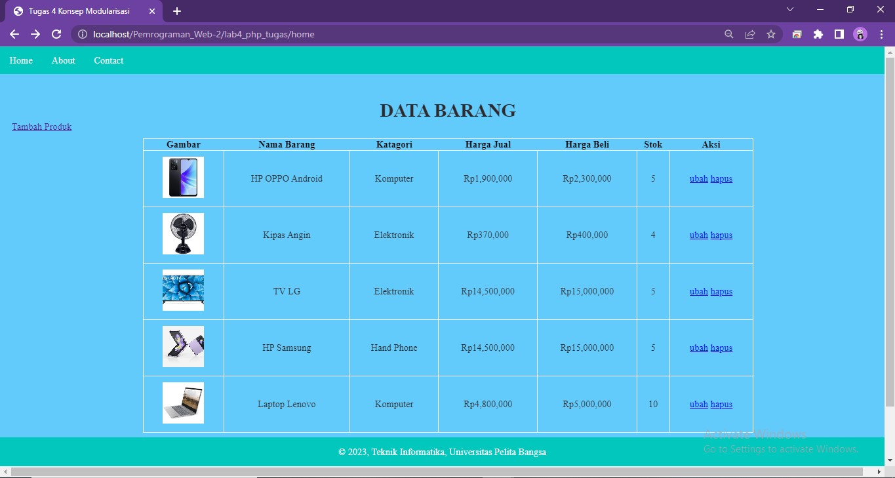

## 3. Tampilan about.php:

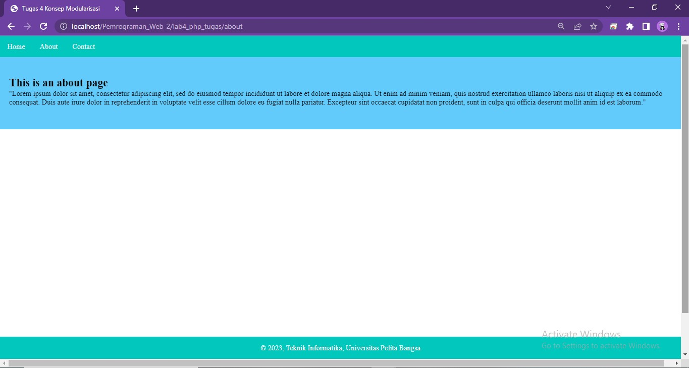

## 4. Tampilan contact.php:

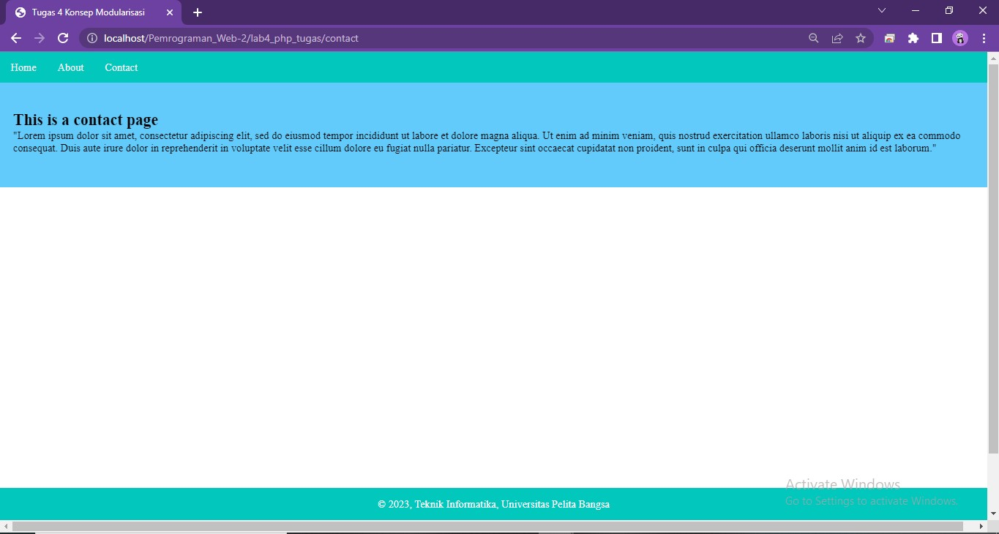

## 5. Tampilan tambah.php:

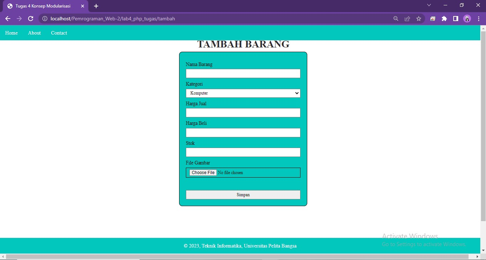

## 6. Tampilan ubah.php:

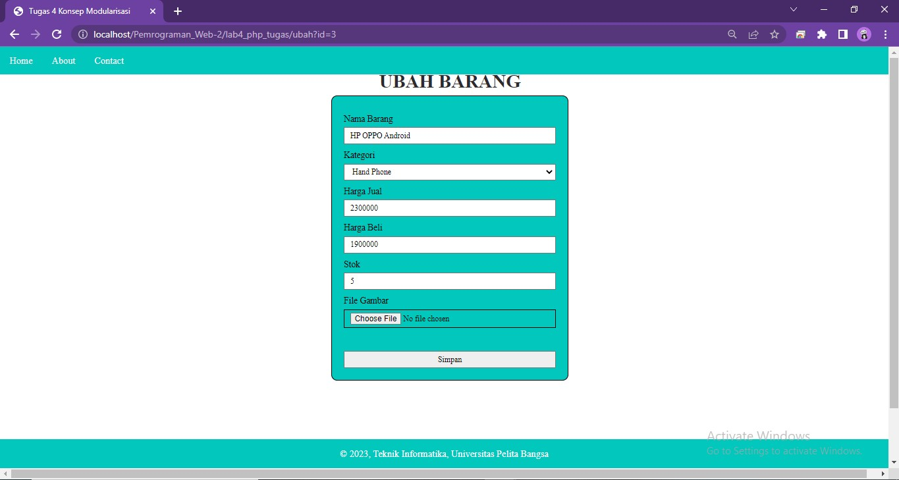